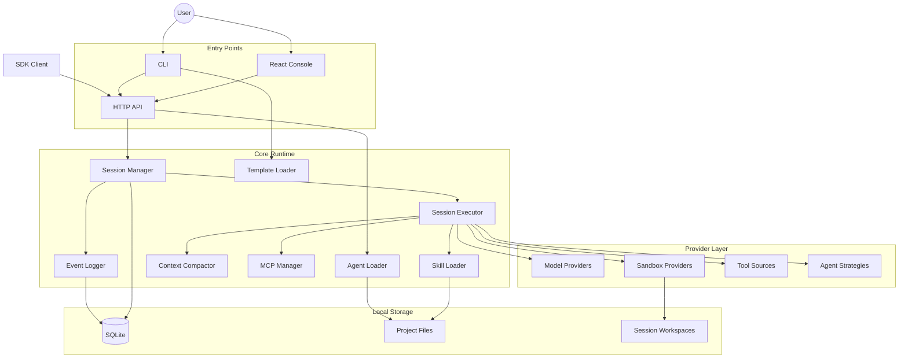
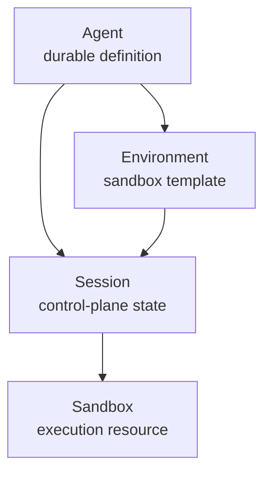
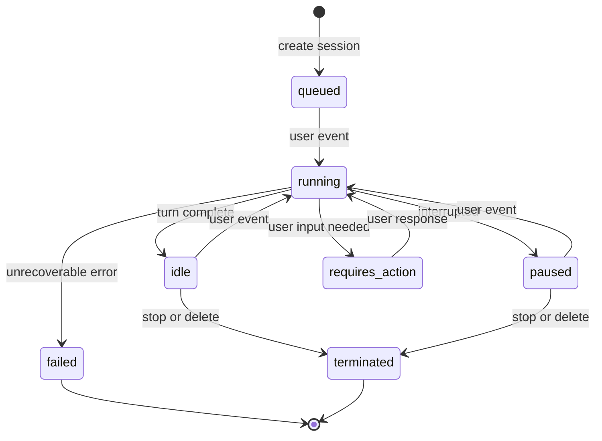
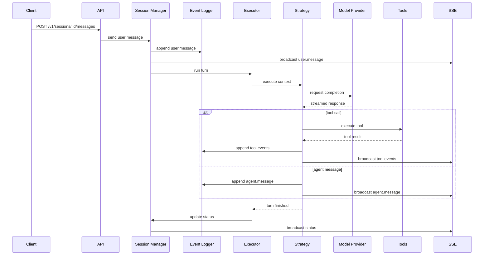
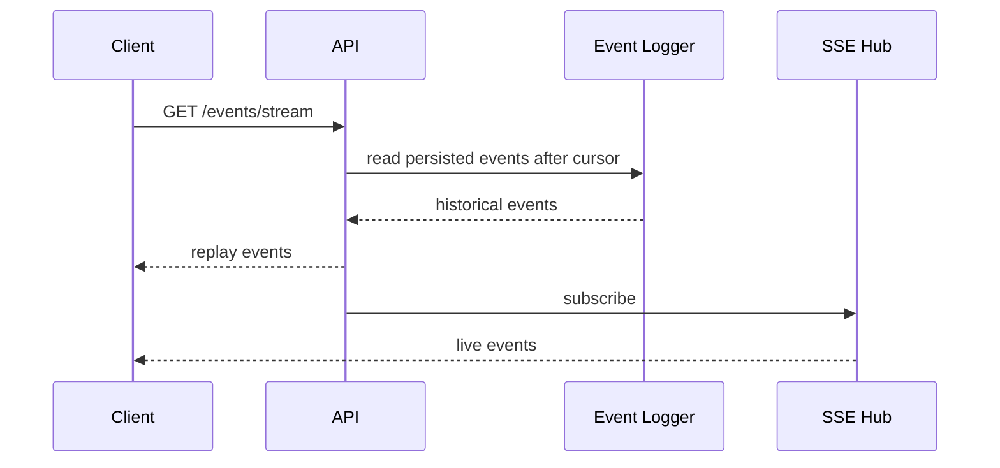
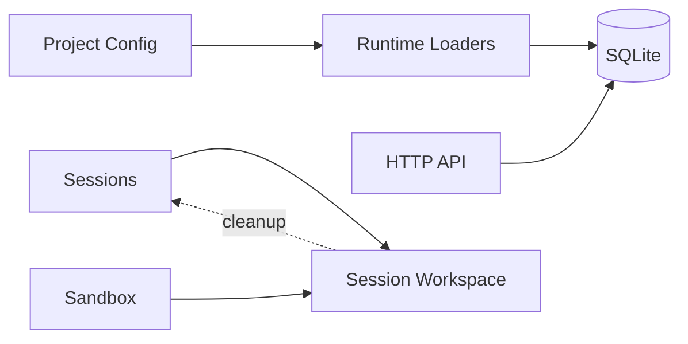
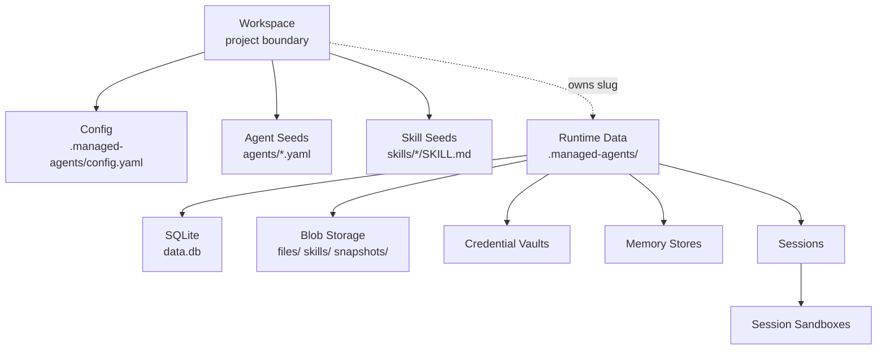
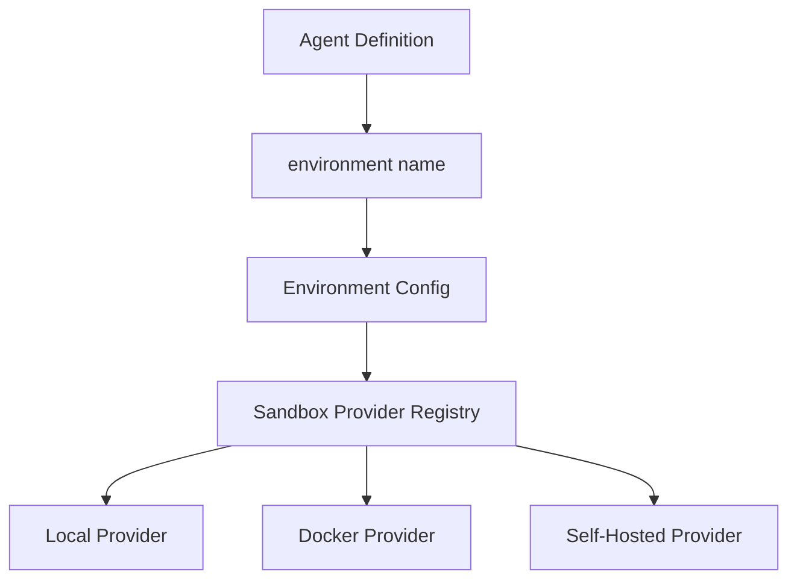

# Architecture

## System Overview



## Four-Layer Runtime Model



- Agent definitions are durable project configuration.
- Environments describe how sandboxes are provisioned.
- Sessions own state, metadata, and event history.
- Sandboxes perform execution for one session at a time.

## Session State Machine



## Session Turn Flow



## Event Replay and Live Stream



Persisted events have a positive sequence number. Transient live chunks use
`seq = 0` and do not advance the replay cursor.

## Data Boundaries



Workspace configuration and runtime state live under the workspace boundary.
Runtime metadata belongs in SQLite at `<workspace>/.managed-agents/data.db` by
default. Uploaded bytes, logs, snapshots, and sandbox workspaces live under the
same workspace state directory and should not be committed unless intentionally
snapshotting local state.

## Workspace Boundary



The Web Console currently exposes the active local workspace as a read-only
runtime boundary. Desktop shells may add create, open, and switch workflows, but
switching workspaces must restart or rebind runtime state so credentials,
memory, session data, and sandbox paths remain scoped to the selected workspace.

## Provider Selection



The executor resolves the sandbox provider from the selected environment before
running a session turn.

## Deployment Modes

### Local Development

```text
CLI or SDK -> local HTTP API -> SQLite + local sandbox
```

This is the default mode.

### Containerized Runtime

```text
Client -> containerized HTTP API -> mounted config + persistent data volume
```

This mode keeps the same project files and API shape.

### Self-Hosted Worker

```text
HTTP API -> work queue -> user-managed worker -> session event results
```

This mode lets users run execution on their own infrastructure while keeping
the session control plane stable.
