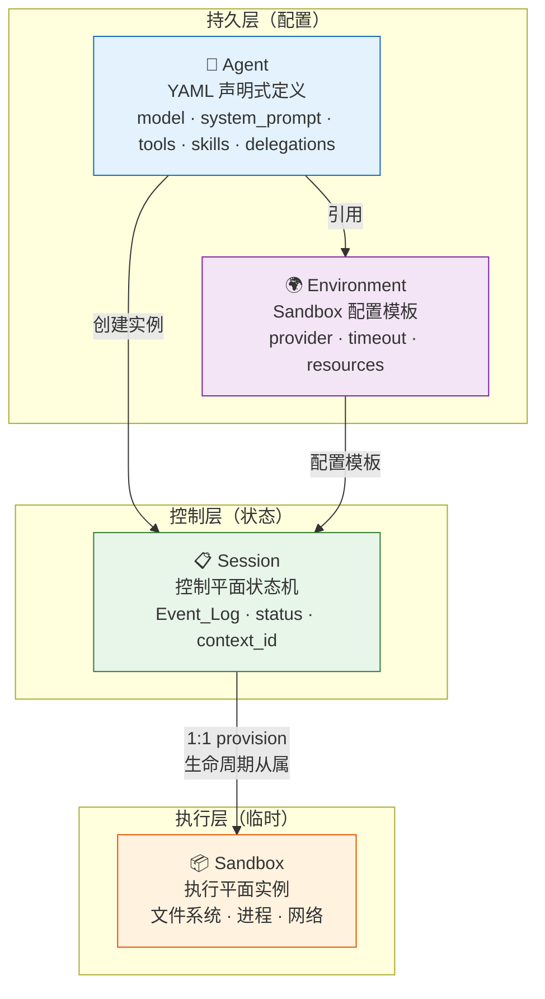
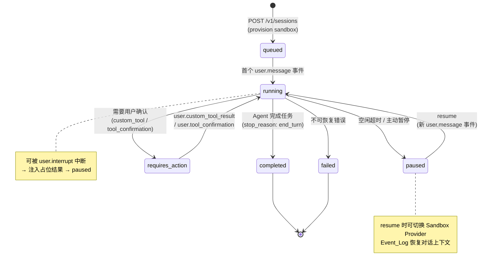
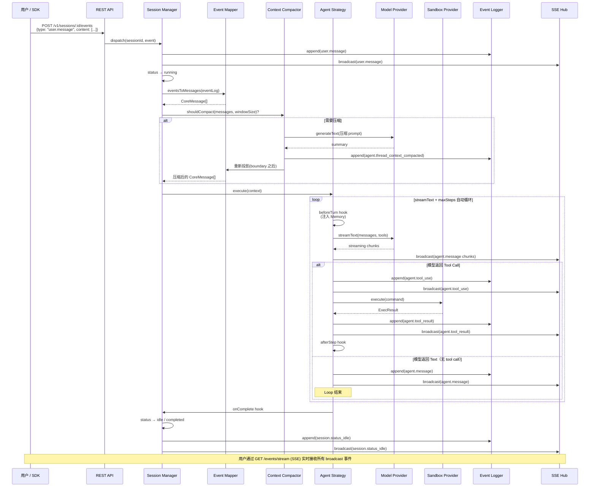
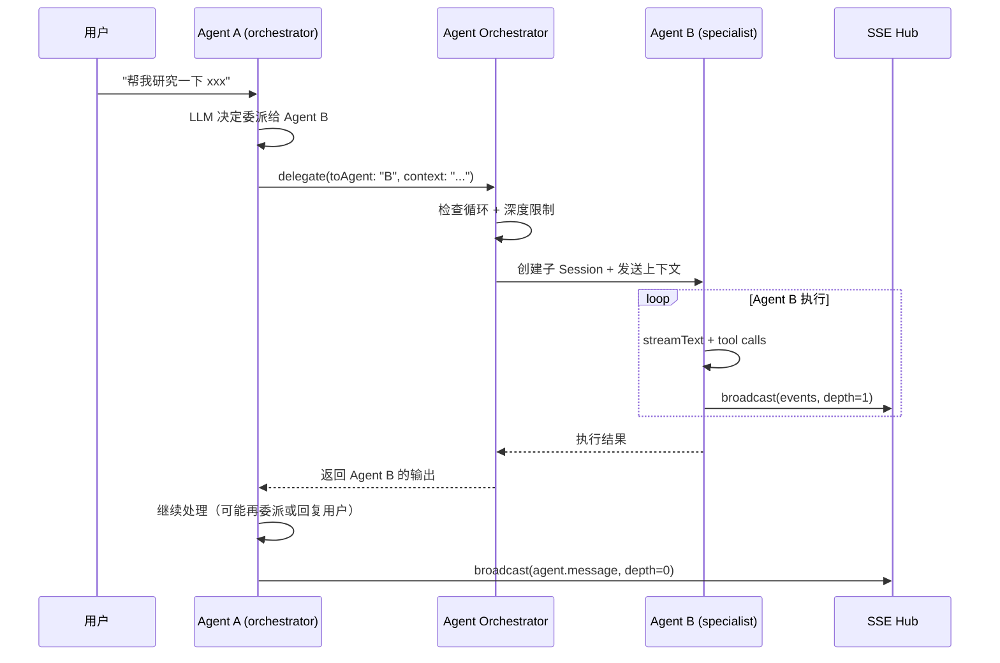
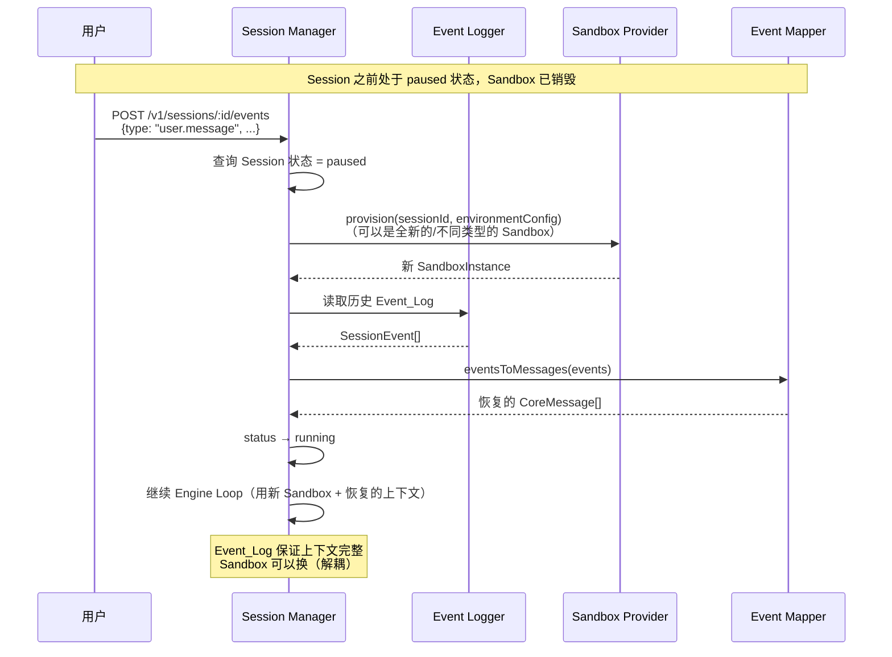
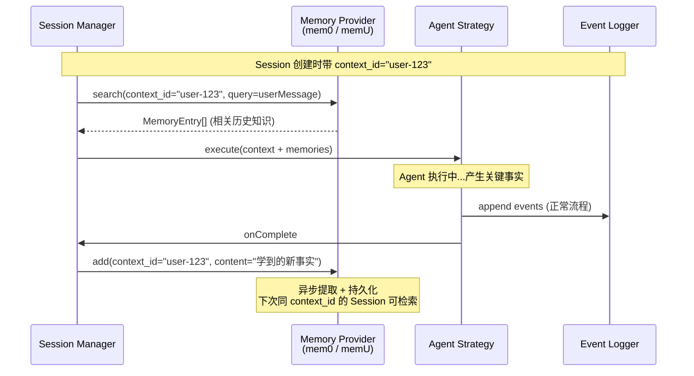
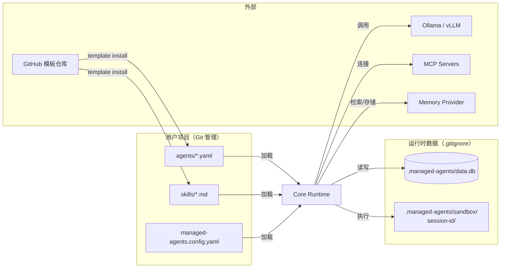
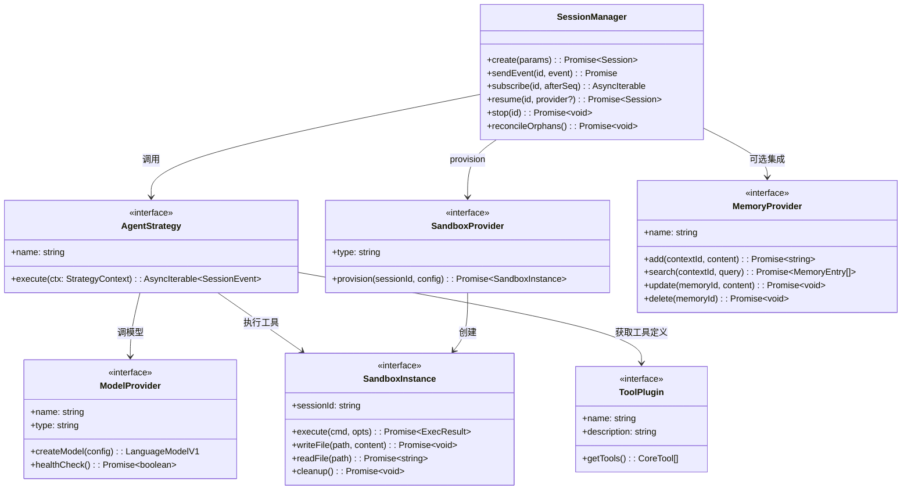
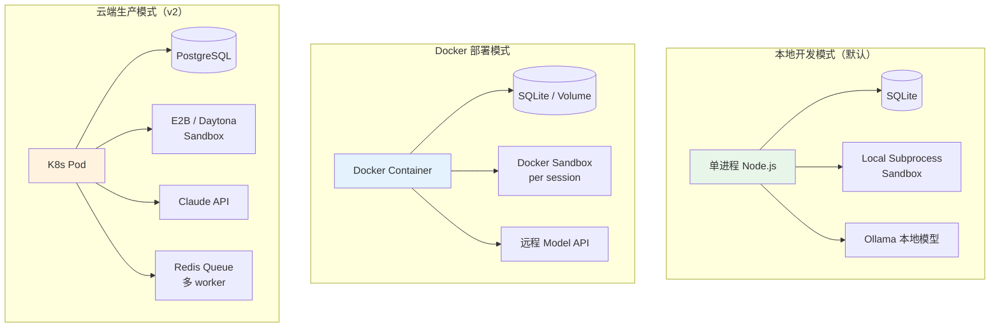

# managed-agents 完整架构图

## 1. 系统总体架构

```mermaid
graph TB
    %% 外部用户
    User((FDE / 用户))
    SDK[外部系统<br/>@anthropic-ai/sdk]
    
    %% 入口层
    subgraph Entry["入口层"]
        CLI[CLI<br/>Commander.js]
        API[REST API<br/>Hono · CMA 兼容]
        Dashboard[Minimal Web Dashboard<br/>embedded HTML]
    end
    
    User --> CLI
    User --> Dashboard
    SDK --> API
    Dashboard --> API
    CLI --> API
    
    %% 核心运行时
    subgraph Core["Core Runtime（控制平面）"]
        SM[Session Manager<br/>状态机 · 生命周期]
        AO[Agent Orchestrator<br/>多 Agent 委派]
        AL[Agent Loader<br/>YAML → Schema 校验]
        EL[Event Logger<br/>append-only · SQLite]
        CC[Context Compactor<br/>80% 阈值摘要]
        EM[Event Mapper<br/>eventsToMessages 双射]
    end
    
    API --> SM
    SM --> AO
    SM --> EL
    SM --> CC
    SM --> EM
    AL --> SM
    
    %% Plugin 扩展层
    subgraph Plugins["Plugin 扩展层（四大接口）"]
        direction TB
        subgraph MP["Model Provider"]
            Ollama[Ollama]
            OpenAI[OpenAI-compat<br/>vLLM / llama.cpp]
            Anthropic[Anthropic]
        end
        subgraph SP["Sandbox Provider"]
            Local[Local Subprocess]
            Docker[Docker]
            E2B[E2B / Daytona]
            SelfHosted[Self-Hosted Worker]
        end
        subgraph TP["Tool Plugin"]
            Builtin[bash · read · write<br/>edit · glob · grep]
            MCP[MCP Tools<br/>stdio / http]
            Custom[Custom Tools]
        end
        subgraph AS["Agent Strategy"]
            Default[DefaultStrategy<br/>streamText + maxSteps]
            Planner[PlannerStrategy<br/>v2]
            RAG[RAGStrategy<br/>v2]
        end
    end
    
    SM --> AS
    AS --> MP
    AS --> SP
    AS --> TP
    
    %% 存储层
    subgraph Storage["存储层"]
        SQLite[(SQLite<br/>data.db)]
        FS[文件系统<br/>agents/ · skills/]
        Sandbox[Sandbox 工作目录<br/>.managed-agents/sandbox/]
    end
    
    EL --> SQLite
    AL --> FS
    SP --> Sandbox
    
    %% 可选扩展
    subgraph Optional["可选扩展"]
        Memory[Memory Provider<br/>mem0 / memU]
        Templates[Template Repository<br/>GitHub 仓库]
    end
    
    SM -.-> Memory
    CLI -.-> Templates
```

## 2. 四层概念模型（CMA 对齐）



## 3. Session 状态机



## 4. Session Engine Loop（核心执行流）



## 5. 多 Agent 委派流程



## 6. Session Resume 流程



## 7. Memory Provider 集成流程



## 8. 项目文件结构与数据流



## 9. Plugin 接口与依赖关系



## 10. 部署架构对比


