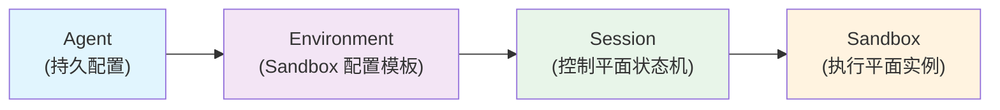
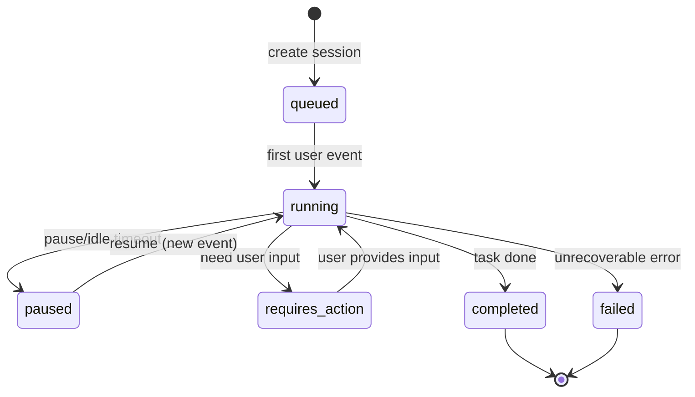
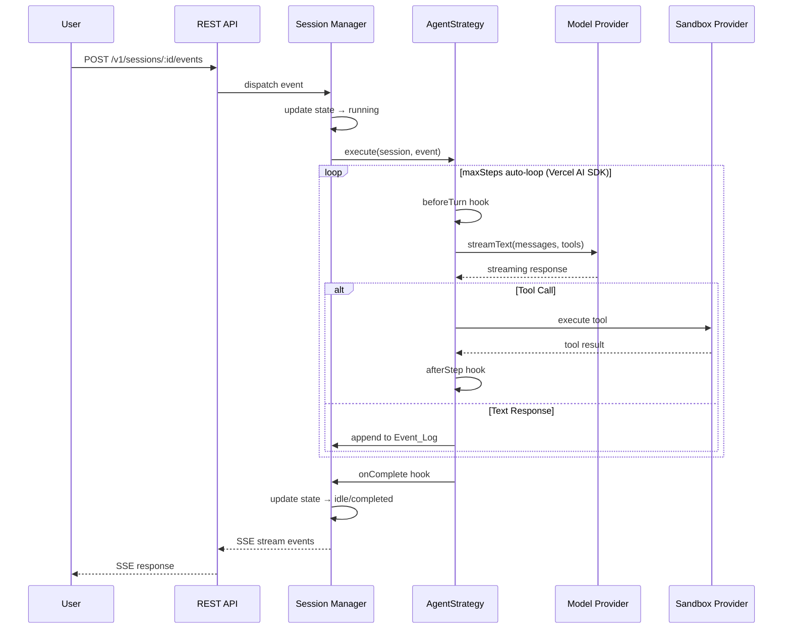
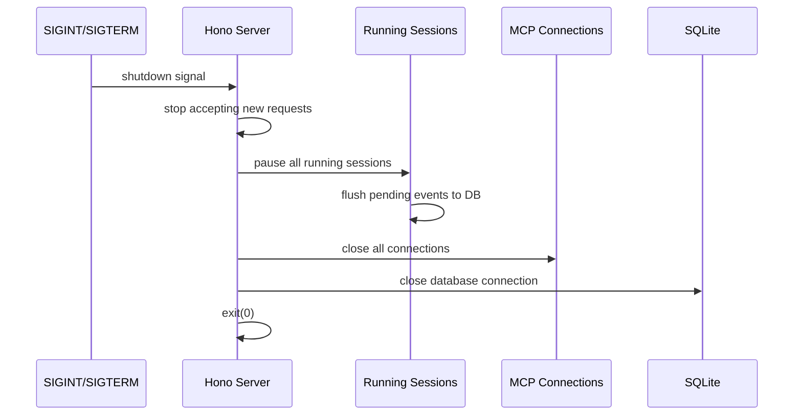

# Design Document — AgentBox Local Agent Platform

## Overview

AgentBox 是一个开源的本地 Agent 运行平台，兼容 Claude Managed Agents (CMA) 协议，支持任意模型（Ollama/vLLM/Claude/GPT），提供声明式多 Agent 编排、MCP 工具集成、场景模板系统和精美 Web Dashboard。

**产品边界：Agent 执行层，非工作流编排层。**

本项目只做「声明式多 Agent 协作」（声明谁可以委派给谁，具体是否委派/委派几次/委派顺序由模型自主决策），不做「可视化 DAG 工作流引擎」（预先定义节点图、条件分支、循环遍历、数据转换的画布式编排，如 Dify/n8n/Sim）。这是刻意的产品边界，防止 scope creep 稀释"CMA 兼容 + 1 分钟启动 + 本地优先"的核心差异化。详见 Requirements 文档「产品边界声明」章节。

**设计哲学：Core small, interfaces stable, extensions via Plugin。**

核心运行时仅负责状态管理和调度，所有"工作"通过四个插件扩展点完成：
1. **Model Provider** — 模型调用适配
2. **Sandbox Provider** — 命令执行后端
3. **Tool Plugin** — 内置工具扩展
4. **Agent Strategy** — 会话循环策略

**技术栈选型：**

| 层 | 技术 | 选型理由 |
|---|---|---|
| HTTP 服务器 | Hono | 轻量、Edge-ready、中间件丰富 |
| Web UI | React + Vite + shadcn/ui + TanStack Query | 生态成熟、HMR 快、静态打包小；参考 OMA Console 设计风格 |
| 数据库 | better-sqlite3 | 零配置、单文件、同步 API 简化并发 |
| AI SDK | Vercel AI SDK | 统一多模型 streaming、内置 maxSteps 循环 |
| MCP 客户端 | @modelcontextprotocol/sdk | 官方实现、协议完整 |
| CLI | Commander.js | Node.js CLI 标准选择 |
| 运行时 | Node.js (>=18) + TypeScript | 全栈统一、生态丰富 |

**协议选型：**

| 协议 | 用途 | 版本 |
|------|------|------|
| CMA | 对外 API 协议（用户用 @anthropic-ai/sdk 连） | v1 核心 |
| MCP | Agent 调外部工具（Agent → Tool Server） | v1 核心 |
| ACP | 委派给外部 Runtime（如 Claude Code/Hermes） | v2 可选 |

**Agent Loop Engine 选型理由**：

选择 Vercel AI SDK 而非外部 runtime（Hermes/Claude Code/OpenClaw）作为 engine，因为：
- 库（可嵌入进程内） vs 完整产品（黑盒子进程）
- 进程内 loop → 每步完全可见（tool call、token、thinking）、可控（中断/重试/compaction）、可记录（Event_Log 写入）
- 委派给外部 runtime 会失去：对话历史完整可见性、Session/Sandbox 分离、模型切换自由度
- v2 若需委派，通过 AgentStrategy 接口加 `ExternalRuntimeStrategy` 实现，不影响核心

---

## Architecture

### 系统架构图

```mermaid
graph TB
    subgraph "AgentBox 单进程"
        CLI[CLI - Commander.js]
        API[REST API - Hono]
        WebUI[Web Dashboard - React/Vite]
        
        CLI --> Core
        API --> Core
        WebUI --> API

        subgraph Core["Core Runtime"]
            SM[Session Manager]
            AO[Agent Orchestrator]
            EL[Event Logger]
            CC[Context Compactor]
        end

        subgraph Plugins["Plugin Extensions"]
            MP[Model Provider]
            SP[Sandbox Provider]
            TP[Tool Plugin]
            AS[Agent Strategy]
        end

        subgraph Storage["Storage Layer"]
            SQLite[(SQLite - better-sqlite3)]
        end

        Core --> Plugins
        Core --> Storage
        
        MP --> Ollama[Ollama]
        MP --> OpenAI[OpenAI-compat]
        MP --> Anthropic[Anthropic]
        
        SP --> Local[Local Subprocess]
        SP --> Docker[Docker]
        SP --> E2B[E2B/Daytona]
    end

    User((FDE)) --> CLI
    User --> WebUI
    SDK[@anthropic-ai/sdk] --> API
```

### 四层概念模型（CMA 对齐）



**层级职责：**
- **Agent**：持久化声明式配置，可复用，定义模型/技能/工具
- **Environment**：可复用的 Sandbox 配置模板（类型、资源限制、超时），不消耗资源
- **Session**：控制平面状态机，管理 Event_Log 和状态转换，持久化到 SQLite
- **Sandbox**：执行平面实例，1:1 绑定 Session，生命周期从属于 Session

### Session 状态机



### Session Engine Loop（基于 Vercel AI SDK）



**AgentStrategy 生命周期钩子：**
- `beforeTurn(context)` — 每轮开始前，用于注入 Memory、检查 token 限制
- `afterStep(step)` — 每步结束后，用于日志记录、状态更新
- `onCompact(summary)` — 上下文压缩触发时，用于自定义压缩逻辑
- `onError(error)` — 执行出错时，用于重试策略、降级处理
- `onComplete(result)` — 执行完成时，用于 Memory 提取、清理资源

---

## Components and Interfaces

### 1. Plugin 扩展点接口

#### Model Provider Interface

```typescript
interface ModelProvider {
  readonly name: string;
  readonly type: 'ollama' | 'openai' | 'anthropic' | string;
  
  /** 创建 Vercel AI SDK 兼容的 LanguageModel 实例 */
  createModel(config: ModelConfig): LanguageModelV1;
  
  /** 健康检查 */
  healthCheck(): Promise<boolean>;
}

interface ModelConfig {
  model: string;        // 模型标识符，如 "gpt-4o", "claude-sonnet-4-20250514"
  baseUrl?: string;     // API 端点
  apiKey?: string;      // 认证密钥（支持 ${ENV_VAR} 引用）
  temperature?: number;
  maxTokens?: number;
}
```

#### Sandbox Provider Interface

```typescript
interface SandboxProvider {
  readonly type: string; // 'local' | 'docker' | 'e2b' | 'daytona' | 'self_hosted'
  
  /** 创建并初始化 Sandbox 实例 */
  provision(sessionId: string, config: EnvironmentConfig): Promise<SandboxInstance>;
}

interface SandboxInstance {
  readonly sessionId: string;
  
  /** 执行 shell 命令 */
  execute(command: string, options?: ExecOptions): Promise<ExecResult>;
  
  /** 写入文件 */
  writeFile(path: string, content: string | Buffer): Promise<void>;
  
  /** 读取文件 */
  readFile(path: string): Promise<string>;
  
  /** 列出目录 */
  listFiles(path: string): Promise<string[]>;
  
  /** 释放资源 */
  cleanup(): Promise<void>;
}

interface ExecOptions {
  timeout?: number;    // 默认 300s
  cwd?: string;
  env?: Record<string, string>;
}

interface ExecResult {
  exitCode: number;
  stdout: string;
  stderr: string;
  timedOut: boolean;
}
```

#### Tool Plugin Interface

```typescript
interface ToolPlugin {
  readonly name: string;
  readonly description: string;
  
  /** 返回该插件提供的所有工具定义 */
  getTools(): CoreTool[];  // Vercel AI SDK CoreTool 类型
}
```

#### Agent Strategy Interface

```typescript
interface AgentStrategy {
  readonly name: string; // 'default' | 'planner' | 'rag' | ...
  
  /** 执行一个完整的会话轮次
   *  内部负责调用生命周期钩子（beforeTurn/afterStep/onCompact/onError/onComplete）
   *  对外只暴露事件流——调用方只需迭代即可获取所有产出的 SessionEvent */
  execute(context: StrategyContext): AsyncIterable<SessionEvent>;
}

interface StrategyContext {
  session: Session;
  messages: CoreMessage[];  // Vercel AI SDK 消息格式
  model: LanguageModelV1;
  tools: Record<string, CoreTool>;
  sandbox: SandboxInstance;
  eventLog: EventLogger;      // 用于 append events
  broadcast: (event: SessionEvent) => void;  // 用于 SSE 实时推送
  config: AgentStrategyConfig;
}

interface AgentStrategyConfig {
  maxSteps?: number;        // 默认 25
  maxTokens?: number;
  temperature?: number;
  beforeTurn?: (ctx: StrategyContext) => Promise<void>;
  afterStep?: (step: StepResult) => Promise<void>;
  onCompact?: (summary: string) => Promise<void>;
  onError?: (error: Error) => Promise<'retry' | 'abort'>;
  onComplete?: (result: CompletionResult) => Promise<void>;
}
```

#### Memory Provider Interface

```typescript
interface MemoryProvider {
  readonly name: string;
  
  /** 添加记忆 */
  add(contextId: string, content: string, metadata?: Record<string, any>): Promise<string>;
  
  /** 搜索相关记忆 */
  search(contextId: string, query: string, limit?: number): Promise<MemoryEntry[]>;
  
  /** 更新记忆 */
  update(memoryId: string, content: string): Promise<void>;
  
  /** 删除记忆 */
  delete(memoryId: string): Promise<void>;
}

interface MemoryEntry {
  id: string;
  content: string;
  relevance: number;
  metadata?: Record<string, any>;
  createdAt: Date;
}
```

### 2. Core Runtime 组件

#### Session Manager

负责 Session 全生命周期管理，是控制平面的核心。

```typescript
class SessionManager {
  /** 创建 Session（两步生命周期第一步：provision sandbox） */
  create(params: CreateSessionParams): Promise<Session>;
  
  /** 发送事件到 Session（两步生命周期第二步：首个事件驱动执行）
   *  返回同步确认（accepted），实际执行结果通过 SSE stream 异步推送 */
  sendEvent(sessionId: string, event: UserEvent): Promise<{ accepted: boolean }>;
  
  /** 订阅 Session 事件流（SSE pub/sub 通道，独立于 sendEvent）
   *  支持 Last-Event-ID resume（通过 events.seq 定位） */
  subscribe(sessionId: string, afterSeq?: number): AsyncIterable<SessionEvent>;
  
  /** 恢复暂停的 Session */
  resume(sessionId: string, newProvider?: SandboxProvider): Promise<Session>;
  
  /** 获取 Session 详情 */
  get(sessionId: string): Promise<Session | null>;
  
  /** 列出 Sessions（分页） */
  list(params: ListParams): Promise<PaginatedResult<Session>>;
  
  /** 停止并清理 Session */
  stop(sessionId: string): Promise<void>;
  
  /** Crash recovery：孤儿状态清理 */
  reconcileOrphans(): Promise<void>;
}
```

#### Agent Orchestrator

负责多 Agent 委派调度。

**已评估但不采纳：Sim (SimStudio) 的 `orchestrators/` 拆分模式**（`parallel.ts` / `loop.ts` / `node.ts`）。Sim 是 DAG workflow 引擎，其 orchestrators 拆分服务于"预定义执行路径的并行/循环节点调度"，属于本项目「产品边界声明」中明确排除的**层次 1：可视化 DAG 编排**。我们的委派是模型自主决策的**层次 2：声明式协作**，不需要预先区分 parallel/loop 等执行拓扑，故不采纳该拆分方式；`AgentOrchestrator` 保持单一类，内部方法按委派语义（`delegate`/`detectCycle`/`getDepth`）组织即可。

```typescript
class AgentOrchestrator {
  /** 执行委派调用 */
  delegate(params: DelegateParams): AsyncIterable<SessionEvent>;
  
  /** 检测循环委派 */
  detectCycle(chain: string[]): boolean;
  
  /** 获取当前委派深度 */
  getDepth(sessionId: string): number;
}

interface DelegateParams {
  fromAgent: string;
  toAgent: string;
  context: string;
  parentSessionId: string;
  depth: number;
  maxDepth?: number; // 默认 5
}
```

#### Context Compactor

负责上下文压缩策略。

```typescript
class ContextCompactor {
  /** 评估当前上下文是否需要压缩 */
  shouldCompact(messages: CoreMessage[], windowSize: number): boolean;
  
  /** 执行压缩：生成摘要 + 写入 boundary 事件 */
  compact(session: Session, model: LanguageModelV1): Promise<CompactionResult>;
}

interface CompactionResult {
  summary: string;
  boundaryEventId: string;
  tokensBefore: number;
  tokensAfter: number;
}
```

#### Event-to-Message Mapper

**核心设计模式（参考 OMA 验证过的双射架构）**：Event_Log 和 LLM 消息之间存在严格的双向映射关系：
- **写入方向**：AgentStrategy.execute 中每次 LLM 步骤完成后，通过 `onStepFinish` 将结果写入 Event_Log
- **读取方向**：下一轮开始前，通过 `eventsToMessages(events)` 将 Event_Log 投影为 `CoreMessage[]`

这两个方向必须严格对偶（bijection），否则 prompt cache 失效。

```typescript
/**
 * 将 Event_Log 投影为 Vercel AI SDK CoreMessage[]。
 * 规则：
 * - 尊重最后一个 agent.thread_context_compacted 边界：
 *   只投影 boundary 之后的 events + summary
 * - 跳过 session.*/span.* 等纯状态事件（不入模型上下文）
 * - tool_use + tool_result 必须配对（孤儿清理已保证）
 * - 严格按 seq 顺序迭代
 */
function eventsToMessages(
  events: SessionEvent[],
  options?: { fileFetcher?: (fileId: string) => Promise<ResolvedFile | null> }
): CoreMessage[];
```

### 3. API Layer（Hono Routes）

```typescript
// CMA 兼容端点 — /v1/*
app.post('/v1/sessions', createSession);
app.get('/v1/sessions', listSessions);
app.get('/v1/sessions/:id', getSession);
app.post('/v1/sessions/:id', updateSession);
app.post('/v1/sessions/:id/events', sendEvents);
app.get('/v1/sessions/:id/events', listEvents);
app.get('/v1/sessions/:id/events/stream', streamEvents);  // SSE
app.post('/v1/sessions/:id/keepalive', keepAlive);
app.post('/v1/sessions/:id/stop', stopSession);
app.delete('/v1/sessions/:id', deleteSession);
app.get('/v1/agents', listAgents);
app.get('/v1/agents/:id', getAgent);

// 扩展端点 — /v1/x/*
app.post('/v1/x/reload', reloadAgents);
app.get('/v1/x/health', healthCheck);
app.get('/v1/x/mcp/status', mcpStatus);
app.get('/v1/x/models', listModels);
app.get('/v1/x/templates', listTemplates);
app.post('/v1/x/templates/install', installTemplate);
```

### 4. 项目目录结构

```
my-project/
├── agents/                    # Agent 定义文件
│   ├── coding-assistant.yaml
│   └── research-analyst.yaml
├── skills/                    # Skill 定义文件 (SKILL.md 格式)
│   ├── code-review.md
│   └── web-search.md
├── agentbox.config.yaml       # 项目配置（模型注册表、环境、Memory 等）
└── .agentbox/                 # 运行时数据（gitignore）
    ├── data.db                # SQLite 数据库
    └── sandbox/               # Local sandbox 工作目录
        └── <session_id>/
```

### 5. 配置文件格式

**agentbox.config.yaml：**

```yaml
# 模型注册表
models:
  - name: gpt-4o
    provider: openai
    model: gpt-4o
    base_url: https://api.openai.com/v1
    api_key: ${OPENAI_API_KEY}
  - name: local-llama
    provider: ollama
    model: llama3.1:70b
    base_url: http://localhost:11434

# 环境定义
environments:
  dev:
    sandbox_provider: local
    timeout: 300
  docker:
    sandbox_provider: docker
    image: node:20-slim
    timeout: 600
    resources:
      memory: 512m
      cpu: 1.0

# Memory 配置（可选）
memory:
  provider: mem0
  config:
    api_key: ${MEM0_API_KEY}

# 模板仓库（可选）
template_repo: https://github.com/agentbox-ai/templates

# 环境级覆盖
overrides:
  local:
    default_model: local-llama
  cloud:
    default_model: gpt-4o
```

**Agent 定义文件示例 (agents/coding-assistant.yaml)：**

```yaml
name: coding-assistant
description: "AI 编程助手，支持代码编写、审查和调试"
model: gpt-4o
system_prompt: |
  你是一个专业的编程助手。你可以编写代码、审查代码、调试问题。
  遵循最佳实践，代码要简洁、可读、高效。
skills:
  - code-review
  - web-search
mcp_servers:
  - name: filesystem
    transport: stdio
    command: npx
    args: ["-y", "@modelcontextprotocol/server-filesystem", "./"]
  - name: github
    transport: http
    url: http://localhost:3001/mcp
    env:
      GITHUB_TOKEN: ${GITHUB_TOKEN}
tools:
  - bash
  - read_file
  - write_file
max_turns: 50
temperature: 0.7
delegations:
  - research-analyst
strategy: default
environment: dev
```

---

## Data Models

### SQLite Schema

```sql
-- 自动迁移版本表
CREATE TABLE _migrations (
  version INTEGER PRIMARY KEY,
  name TEXT NOT NULL,
  applied_at TEXT NOT NULL DEFAULT (datetime('now'))
);

-- Agent 运行时状态（从 YAML 加载后的缓存）
CREATE TABLE agents (
  id TEXT PRIMARY KEY,           -- 自动生成的 agent_xxx 格式
  name TEXT NOT NULL UNIQUE,     -- Agent 名称（YAML 中的 name 字段）
  definition TEXT NOT NULL,      -- 完整 YAML 定义（JSON 序列化）
  status TEXT NOT NULL DEFAULT 'active',  -- active | error | disabled
  error_message TEXT,
  loaded_at TEXT NOT NULL DEFAULT (datetime('now')),
  updated_at TEXT NOT NULL DEFAULT (datetime('now'))
);

-- Environment 定义
CREATE TABLE environments (
  id TEXT PRIMARY KEY,           -- env_xxx 格式
  name TEXT NOT NULL UNIQUE,
  config TEXT NOT NULL,          -- JSON 序列化的 EnvironmentConfig
  created_at TEXT NOT NULL DEFAULT (datetime('now'))
);

-- Session 状态机
CREATE TABLE sessions (
  id TEXT PRIMARY KEY,           -- sess_xxx 格式
  agent_id TEXT NOT NULL,
  agent_name TEXT NOT NULL,
  environment_id TEXT NOT NULL,
  status TEXT NOT NULL DEFAULT 'queued',  -- queued|running|paused|requires_action|completed|failed
  title TEXT,
  context_id TEXT,               -- 可选，用于跨 Session 记忆共享
  metadata TEXT,                 -- JSON
  sandbox_type TEXT,             -- 当前绑定的 sandbox provider 类型
  sandbox_state TEXT,            -- JSON: sandbox 连接信息
  usage_tokens_in INTEGER DEFAULT 0,
  usage_tokens_out INTEGER DEFAULT 0,
  created_at TEXT NOT NULL DEFAULT (datetime('now')),
  updated_at TEXT NOT NULL DEFAULT (datetime('now')),
  completed_at TEXT,
  FOREIGN KEY (agent_id) REFERENCES agents(id),
  FOREIGN KEY (environment_id) REFERENCES environments(id)
);

CREATE INDEX idx_sessions_agent ON sessions(agent_id);
CREATE INDEX idx_sessions_status ON sessions(status);
CREATE INDEX idx_sessions_context ON sessions(context_id);
CREATE INDEX idx_sessions_created ON sessions(created_at DESC);

-- Event Log（append-only）
CREATE TABLE events (
  id TEXT PRIMARY KEY,           -- sevt_xxx 格式
  session_id TEXT NOT NULL,
  seq INTEGER NOT NULL,          -- 自增序号，用于排序和 SSE Last-Event-ID resume
  type TEXT NOT NULL,            -- user.message|agent.message|agent.tool_use|agent.tool_result|...
  content TEXT,                  -- JSON: content blocks
  model_used TEXT,
  tokens_in INTEGER DEFAULT 0,
  tokens_out INTEGER DEFAULT 0,
  stop_reason TEXT,
  duration_ms INTEGER,
  parent_event_id TEXT,          -- 用于委派追踪
  delegation_depth INTEGER DEFAULT 0,
  created_at TEXT NOT NULL DEFAULT (datetime('now')),
  processed_at TEXT,
  FOREIGN KEY (session_id) REFERENCES sessions(id)
);

CREATE INDEX idx_events_session_seq ON events(session_id, seq);
CREATE INDEX idx_events_session_time ON events(session_id, created_at);
CREATE INDEX idx_events_type ON events(session_id, type);

-- Context Compaction 边界记录
CREATE TABLE compaction_boundaries (
  id TEXT PRIMARY KEY,
  session_id TEXT NOT NULL,
  summary TEXT NOT NULL,         -- 压缩摘要
  event_id_before TEXT NOT NULL, -- boundary 之前最后一个事件 ID
  tokens_before INTEGER NOT NULL,
  tokens_after INTEGER NOT NULL,
  created_at TEXT NOT NULL DEFAULT (datetime('now')),
  FOREIGN KEY (session_id) REFERENCES sessions(id)
);

-- 模型注册表（从配置文件加载后缓存）
CREATE TABLE models (
  name TEXT PRIMARY KEY,
  provider TEXT NOT NULL,
  model TEXT NOT NULL,
  base_url TEXT,
  config TEXT,                   -- JSON: 其他配置
  created_at TEXT NOT NULL DEFAULT (datetime('now'))
);

-- Workspace 快照（可选功能）
CREATE TABLE snapshots (
  id TEXT PRIMARY KEY,
  session_id TEXT NOT NULL,
  path TEXT NOT NULL,            -- 快照文件路径（tar.gz）
  size_bytes INTEGER NOT NULL,
  created_at TEXT NOT NULL DEFAULT (datetime('now')),
  FOREIGN KEY (session_id) REFERENCES sessions(id)
);
```

### 核心 TypeScript 类型

```typescript
// === Session 相关 ===

type SessionStatus = 
  | 'queued' 
  | 'running' 
  | 'paused' 
  | 'requires_action' 
  | 'completed' 
  | 'failed';

interface Session {
  id: string;                    // sess_xxx
  agentId: string;
  agentName: string;
  environmentId: string;
  status: SessionStatus;
  title?: string;
  contextId?: string;
  metadata?: Record<string, any>;
  sandboxType?: string;
  usage?: { tokensIn: number; tokensOut: number };
  createdAt: Date;
  updatedAt: Date;
  completedAt?: Date;
}

// === Event 相关 ===

type EventType =
  | 'user.message'
  | 'user.interrupt'
  | 'user.custom_tool_result'
  | 'user.tool_confirmation'
  | 'agent.message'
  | 'agent.thinking'
  | 'agent.tool_use'
  | 'agent.tool_result'
  | 'agent.mcp_tool_use'
  | 'agent.mcp_tool_result'
  | 'agent.custom_tool_use'
  | 'agent.thread_context_compacted'
  | 'session.status_idle'
  | 'session.status_running'
  | 'session.status_rescheduled'
  | 'session.status_terminated'
  | 'session.error'
  | 'session.deleted'
  | 'span.model_request_start'
  | 'span.model_request_end'
  | 'turn_complete';

interface SessionEvent {
  id: string;                   // sevt_xxx
  sessionId: string;
  type: EventType;
  content?: ContentBlock[];
  modelUsed?: string;
  tokensIn?: number;
  tokensOut?: number;
  stopReason?: string;
  durationMs?: number;
  parentEventId?: string;
  delegationDepth?: number;
  createdAt: Date;
  processedAt?: Date;
}

type ContentBlock =
  | { type: 'text'; text: string }
  | { type: 'image'; source: ImageSource }
  | { type: 'tool_use'; id: string; name: string; input: any }
  | { type: 'tool_result'; tool_use_id: string; content: string; is_error?: boolean };

// === Agent 定义 ===

interface AgentDefinition {
  name: string;                  // 必填：唯一标识符
  model: string;                 // 必填：模型注册表引用
  system_prompt: string;         // 必填：系统提示词
  description?: string;
  skills?: string[];
  mcp_servers?: McpServerConfig[];
  tools?: string[];
  max_turns?: number;            // 默认 50
  temperature?: number;          // 默认 0.7
  delegations?: string[];
  enable_general_subagent?: boolean;  // CMA 内置通用子代理机制，见需求 3.7
  strategy?: string;             // 默认 'default'
  environment?: string;          // 默认 'dev'
}

interface McpServerConfig {
  name: string;
  transport: 'stdio' | 'http';
  // stdio transport
  command?: string;
  args?: string[];
  // http transport
  url?: string;
  // 共用
  env?: Record<string, string>;  // 支持 ${ENV_VAR} 引用
  timeout?: number;              // 连接超时，默认 30s
}

// === Environment 定义 ===

interface EnvironmentConfig {
  name: string;
  sandbox_provider: 'local' | 'docker' | 'e2b' | 'daytona' | 'self_hosted';
  timeout?: number;              // 默认 300s
  resources?: {
    memory?: string;             // 如 '512m'
    cpu?: number;                // 如 1.0
  };
  snapshot?: {
    enabled: boolean;
    interval_seconds?: number;   // 快照间隔
  };
  // Docker 专用
  image?: string;
  // E2B/Daytona 专用
  api_key?: string;
  template_id?: string;
}

// === Template 相关 ===

interface TemplateManifest {
  name: string;
  description: string;
  version?: string;
  author?: string;
  tags?: string[];
}

interface TemplateStructure {
  manifest: TemplateManifest;
  agents: string[];              // Agent YAML 文件名列表
  skills?: string[];             // Skill MD 文件名列表
  mcp?: string[];                // MCP 配置文件名列表
}
```

---

## Correctness Properties

*A property is a characteristic or behavior that should hold true across all valid executions of a system — essentially, a formal statement about what the system should do. Properties serve as the bridge between human-readable specifications and machine-verifiable correctness guarantees.*

### Property 1: Agent 定义 Schema 验证完备性

*For any* 随机生成的 Agent 定义对象，如果对象缺少必填字段（name/model/system_prompt）或字段类型不合法，Schema 验证 SHALL 拒绝该定义并返回具体错误信息；如果所有字段合法，验证 SHALL 通过。

**Validates: Requirements 2.2, 2.4, 2.6**

### Property 2: Skill 解析 Round-Trip

*For any* 合法的 SKILL.md 文件内容，经过 `parse(content)` 解析为结构化对象后，再通过 `serialize(obj)` 序列化回 Markdown，得到的结果经过再次 `parse` 应产生语义等价的对象。

**Validates: Requirements 4.6**

### Property 3: Agent 技能子集隔离

*For any* 一组 Agent 和一组 Skill 的任意分配方案，每个 Agent 构建的系统上下文 SHALL 仅包含其分配的 Skill 子集，不包含未分配的 Skill 信息。

**Validates: Requirements 4.4, 4.5**

### Property 4: 循环委派检测

*For any* Agent 委派有向图中存在环路（如 A→B→C→A），Multi_Agent_Orchestrator SHALL 在环路形成前检测到循环并终止执行链，返回错误。

**Validates: Requirements 3.3**

### Property 5: 最大委派深度强制执行

*For any* 委派链深度超过配置的 maxDepth（默认 5），Multi_Agent_Orchestrator SHALL 在达到上限时终止执行并返回深度超限错误。

**Validates: Requirements 3.4**

### Property 6: Session 状态机合法转换

*For any* Session 的事件序列，状态转换 SHALL 只在合法路径上发生：`queued→running`、`running→paused`、`running→requires_action`、`running→completed`、`running→failed`、`paused→running`、`requires_action→running`。不存在其他合法转换路径。

**Validates: Requirements 9.4**

### Property 7: Event_Log Append-Only 不变量

*For any* Session 的事件操作序列，Event_Log 长度 SHALL 单调递增，已写入的事件内容和顺序 SHALL 不会被修改或删除。

**Validates: Requirements 9.6**

### Property 8: Session Resume 上下文恢复

*For any* 暂停的 Session，无论 resume 时绑定的 Sandbox Provider 是否与创建时相同，从 Event_Log 重建的模型上下文 SHALL 与暂停前的上下文语义等价（消息序列一致）。

**Validates: Requirements 9.5, 9.7**

### Property 9: Sandbox 实例隔离

*For any* 两个引用同一 Environment 的 Session，各自获得的 Sandbox 实例 SHALL 互相隔离——在一个 Sandbox 中写入的文件不会出现在另一个 Sandbox 的文件系统中。

**Validates: Requirements 9.3, 12.6**

### Property 10: Crash Recovery 孤儿清理

*For any* 进程 crash 时处于 `running` 状态的 Session 集合，重启后孤儿清理 SHALL 确保：所有未收到结果的工具调用被注入 interrupted 占位结果，使下一轮模型消息序列完整合法。

**Validates: Requirements 9.10**

### Property 11: Context Compaction 触发阈值

*For any* Session 的消息序列，当投影为模型上下文后 token 数超过模型窗口的 80% 时，Context Compaction SHALL 被触发；触发后的上下文 token 数 SHALL 低于窗口的 80%。

**Validates: Requirements 9.15**

### Property 12: MCP 重连指数退避

*For any* MCP 连接失败序列，重试间隔 SHALL 遵循指数退避策略（间隔倍增），最大间隔不超过 60 秒，最多重试 5 次后放弃。

**Validates: Requirements 5.6**

### Property 13: 环境变量引用解析

*For any* 配置字符串中包含的 `${VAR_NAME}` 引用，如果对应环境变量存在，SHALL 被解析为实际值；如果不存在，SHALL 保留原始字符串或报错（取决于上下文是否必需）。

**Validates: Requirements 5.7**

### Property 14: 模型调用重试策略正确性

*For any* 模型调用错误类型，网络超时 SHALL 重试最多 3 次，认证失败 SHALL 不重试，速率限制 SHALL 按 Retry-After 等待后重试。重试次数和等待时间严格遵循规则。

**Validates: Requirements 6.6**

### Property 15: CMA API 未知字段向前兼容

*For any* CMA 兼容端点的请求体，包含任意额外的未知字段时，API SHALL 正常处理请求且响应不受影响（未知字段被忽略）。

**Validates: Requirements 7.6**

### Property 16: Session 分页查询正确性

*For any* N 条 Session 记录，以任意 pageSize 进行分页查询，所有页面合并后 SHALL 包含全部 N 条记录，无重复、无遗漏，且按 created_at 降序排列。

**Validates: Requirements 8.5**

### Property 17: 数据库迁移幂等性

*For any* 迁移序列重复执行，最终 schema 状态 SHALL 与单次执行一致，已有数据不丢失、不重复。

**Validates: Requirements 8.4**

### Property 18: 模板安装文件放置

*For any* 合法的 Template 结构，执行 install 后，模板中 `agents/` 目录的文件 SHALL 出现在项目的 `agents/` 目录中，`skills/` 目录的文件 SHALL 出现在项目的 `skills/` 目录中，文件内容字节一致。

**Validates: Requirements 14.4**

### Property 19: 模板 Create/Validate Round-Trip

*For any* 项目中的合法 Agent 和 Skill 文件集合，通过 `template create` 导出为模板目录后，该模板 SHALL 符合约定的目录结构（包含 manifest.yaml 和 agents/），且通过 `template install` 安装回另一项目后，文件内容与原始项目一致。

**Validates: Requirements 14.1, 14.8**

### Property 20: Sandbox 执行超时强制终止

*For any* 超过配置超时时间的命令执行，Sandbox Provider SHALL 终止该命令并返回 `timedOut: true` 结果，不会无限等待。

**Validates: Requirements 12.5**

---

## Error Handling

### 错误分级策略

| 级别 | 场景 | 处理方式 |
|------|------|---------|
| **Fatal** | SQLite 打不开、端口被占用 | 输出错误信息 + 退出进程（exit code 1） |
| **Startup Warning** | Agent YAML 解析失败、Skill 引用不存在 | 日志警告 + 跳过该项 + 继续启动 |
| **Runtime Recoverable** | MCP 连接断开、模型调用超时 | 重试策略（指数退避） + 降级运行 |
| **Runtime Fatal** | Session 执行中不可恢复错误 | Session 状态 → failed + Event_Log 记录 |
| **User Error** | API 请求参数错误、引用不存在的 Agent | 返回 4xx + 结构化错误体 |

### API 错误响应格式

遵循 CMA 协议错误格式：

```typescript
interface ApiError {
  error: {
    type: string;       // 'invalid_request' | 'not_found' | 'conflict' | 'internal_error'
    message: string;    // 人类可读的错误描述
    details?: any;      // 可选的详细信息（如字段级验证错误）
  };
}
```

### CLI 错误输出规范

```
Error: [TYPE] reason
  → suggestion for fix

Example:
Error: [AGENT_LOAD] agents/broken.yaml - missing required field 'model' at line 3
  → Add a 'model' field referencing a registered model name (see agentbox.config.yaml)
```

### 重试策略明细

| 错误类型 | 重试 | 策略 |
|---------|------|------|
| 网络超时（模型调用） | 是 | 最多 3 次，无退避 |
| 速率限制（429） | 是 | 按 Retry-After 头等待，最多 3 次 |
| 认证失败（401/403） | 否 | 立即失败，提示检查 API Key |
| MCP 连接中断 | 是 | 指数退避（1s→2s→4s→8s→16s→32s→60s），最多 5 次 |
| Sandbox 命令超时 | 否 | 返回 timedOut 结果，由 Agent Strategy 决定下步 |
| SQLite 写入失败 | 是 | 最多 3 次，100ms 间隔（处理 SQLITE_BUSY） |

### 优雅关闭流程



---

## Testing Strategy

### 测试框架选型

| 类型 | 工具 | 说明 |
|------|------|------|
| 单元测试 | Vitest | 与 Vite 生态一致，速度快 |
| Property-Based Testing | fast-check | TypeScript 生态最成熟的 PBT 库 |
| 集成测试 | Vitest + supertest | HTTP API 集成测试 |
| E2E 测试 | Playwright | Web UI 端到端测试 |

### Property-Based Testing 配置

- 库：**fast-check**（TypeScript PBT 标准选择）
- 每个 property test 最低运行 **100 次迭代**
- 每个 test 必须标注对应的 Design Property 引用
- Tag 格式：`Feature: local-agent-platform, Property {N}: {title}`

### 测试分层

```
tests/
├── unit/                       # 纯函数单元测试
│   ├── schema-validator.test.ts
│   ├── skill-parser.test.ts
│   ├── context-compactor.test.ts
│   ├── env-resolver.test.ts
│   └── delegation-detector.test.ts
├── property/                   # Property-Based Tests
│   ├── schema-validation.prop.ts      # Property 1
│   ├── skill-roundtrip.prop.ts        # Property 2
│   ├── skill-isolation.prop.ts        # Property 3
│   ├── cycle-detection.prop.ts        # Property 4
│   ├── depth-limit.prop.ts            # Property 5
│   ├── state-machine.prop.ts          # Property 6
│   ├── event-log-append.prop.ts       # Property 7
│   ├── session-resume.prop.ts         # Property 8
│   ├── sandbox-isolation.prop.ts      # Property 9
│   ├── orphan-cleanup.prop.ts         # Property 10
│   ├── compaction-threshold.prop.ts   # Property 11
│   ├── mcp-backoff.prop.ts            # Property 12
│   ├── env-var-resolve.prop.ts        # Property 13
│   ├── retry-strategy.prop.ts         # Property 14
│   ├── unknown-fields.prop.ts         # Property 15
│   ├── pagination.prop.ts             # Property 16
│   ├── migration-idempotent.prop.ts   # Property 17
│   ├── template-install.prop.ts       # Property 18
│   ├── template-roundtrip.prop.ts     # Property 19
│   └── sandbox-timeout.prop.ts        # Property 20
├── integration/                # 集成测试
│   ├── api/                    # CMA API 兼容性
│   ├── mcp/                    # MCP 连接
│   └── model/                  # 模型适配
└── e2e/                        # Web UI E2E
    ├── conversation.spec.ts
    └── agent-management.spec.ts
```

### 单元测试覆盖重点

- **Agent 定义加载**：合法/非法 YAML 解析、必填字段校验、可选字段默认值
- **Skill 解析器**：Markdown 结构解析、字段提取、格式容错
- **状态机转换**：每个合法/非法转换路径的验证
- **环境变量解析**：`${VAR}` 语法解析、嵌套引用、缺失变量处理
- **分页逻辑**：边界条件（空结果集、单页、末页）
- **CLI 输出**：错误信息格式化、彩色输出

### 集成测试覆盖重点

- **CMA API 兼容性**：使用 `@anthropic-ai/sdk` 实际调用本地 API，验证协议一致性
- **MCP 连接**：stdio 和 http 两种传输方式的连接/断开/重连
- **模型适配**：各 provider 的基本调用（使用 mock server）
- **Session 完整生命周期**：create → event → execute → complete/fail

### Property Test 示例

```typescript
// Property 4: 循环委派检测
// Feature: local-agent-platform, Property 4: 循环委派检测
import { fc } from 'fast-check';
import { detectCycle } from '../src/orchestrator';

describe('Property 4: Cycle Detection', () => {
  it('should detect any cycle in delegation graph', () => {
    fc.assert(
      fc.property(
        // 生成包含环路的有向图
        fc.array(fc.string(), { minLength: 2, maxLength: 10 }).chain(nodes =>
          fc.record({
            nodes: fc.constant(nodes),
            edges: fc.array(
              fc.tuple(
                fc.integer({ min: 0, max: nodes.length - 1 }),
                fc.integer({ min: 0, max: nodes.length - 1 })
              )
            ),
            // 强制加入一条回边形成环路
            cycleBack: fc.tuple(
              fc.integer({ min: 0, max: nodes.length - 1 }),
              fc.integer({ min: 0, max: nodes.length - 1 })
            )
          })
        ),
        (graph) => {
          const chain = buildChainWithCycle(graph);
          expect(detectCycle(chain)).toBe(true);
        }
      ),
      { numRuns: 100 }
    );
  });
});
```

### 不适用 PBT 的部分

以下部分使用示例测试或集成测试而非 PBT：
- **Web UI 渲染**：使用 Playwright E2E 测试 + React Testing Library
- **MCP 协议通信**：使用 mock MCP server 的集成测试
- **模型实际调用**：使用 mock 模型的集成测试
- **CLI 交互命令**（chat）：手动测试 + 少量 E2E 脚本
- **Docker Sandbox**：需要 Docker daemon 的集成测试（CI 环境）
